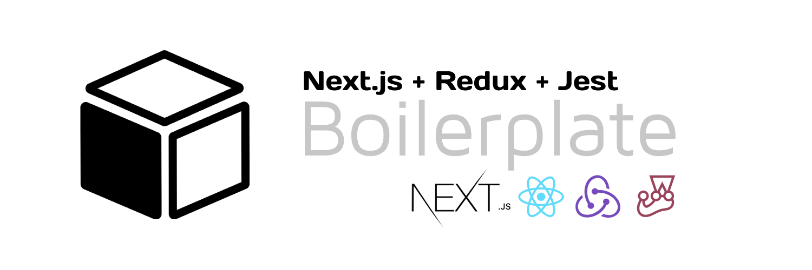

<div align="center">

[](https://github.com/apache/incubator-echarts)
[](https://github.com/apache/incubator-echarts)
[](https://github.com/apache/incubator-echarts)
[](https://github.com/apache/incubator-echarts)

🚀 A minimal jump-start boilerplate based on **Next** + **Redux** for building super-performant **SSR React** websites.

</div>

### Features

- 🔥 **SSR** – [Next](https://nextjs.org) for Static Site Generator.
- ⚛️ **State Management** – [Redux](https://react-redux.js.org) for managing and centralizing application state.
- ⌛️ **Async Logic** – [Thunks](https://github.com/reduxjs/redux-thunk) for asynchronous logic that interacts with the Redux store
- 🗳 **Persisting State** – [Redux Persist](https://github.com/rt2zz/redux-persist) for persist and rehydrate the Redux store
- � **Integrated testing** – [Jest](https://jestjs.io/) for creating, running, and structuring tests.
- ⚙️ **Bundle Analyzer** – [Bundler Analyzer](https://www.npmjs.com/package/@next/bundle-analyzer) for anaylizing builds.
- 🎨 **Styles** – Unopinionated! Why? 👉 [Read this](#Styles)

---

## Table of Contents

- [Overview](#Overview)
- [Installation](#Installation)
- [Usage](#Usage)
- [Props](#Props)
- [Contributing](#Contributing)
- [Code of Conduct](#code-of-conduct)
- [License](#License)

## Overview

Modern web development technologies have evolved incredibly fast in the last few years in such a way that we can now create cross-platform desktop apps using resources originally thought for web browsers.

Nevertheless, this usually require a lot of setup to make things work: Webpack to bundle your code, Babel for transpiling, Eslint for linting... Not to mention that when creating Electron applications, all of that setup just becomes more difficult.

The primary aim of rew-electron-boilerplate is to eliminate all preliminary setup with one simple install so you can focus in developing your application.

## Installation

Create a repo in your profile via the "Use this template" option.

Install dependencies:

```bash
yarn
```

...and, you're ready to go!

## Usage

### Project structure

The basic structure of the project is provided in the following way. No configuration needed, just the files you need to build your app.

```bash
.
├── README.md                # README file
├── .babelrc           # Jest JS configuration
├── .eslintignore           # Jest JS configuration
├── .gitignore           # Jest JS configuration
├── .prettierignore           # Jest JS configuration
├── .prettierrc          # Jest JS configuration
├── jest.config.js           # Jest JS configuration
├── next.config.js           # Next JS configuration
├── public                   # Public folder
│   ├── manifest.json        # Your manifest.json
│   └── favicon.ico          # Change this
└── src
    ├── components           # Components for the app
    ├── constants            # Global constants
    ├── helpers              # Reused logic across the app
    ├── hooks                # State logic for components
    ├── HOCs                 # Wrapped logic for components
    ├── pages                # Next JS pages
    └── styles               # Global CSS files
```

### Redux Architecture

The architecture for the redux management is inspired in [this proposal](https://github.com/alexnm/re-ducks) by [Alex Moldovan](https://github.com/alexnm)
where he revisits the [original ducks modular approach proposal](https://github.com/erikras/ducks-modular-redux).

### Styles

No custom solution for styling has been included in this boilerplate. The reason is simple: there is wide range of options (SASS, Tailwinds, JSS, Emotion, etc) for styling React apps nowadays, and it is difficult to choose one that fits in every pocket.

Since everyone has her personal preference, I have decided not to include any option and leave that decision to be taken by the dev.

### Commands

- `dev`: runs your application on `localhost:3000`
- `build`: creates the production build version
- `start`: starts a simple server with the build production code
- `lint`: runs the linter in all components and pages
- `test`: runs jest to test all components and pages
- `test:watch`: runs jest in watch mode

## Contributing

No one’s perfect. If you’ve found any errors, want to suggest enhancements, or expand on a topic, please feel free to open an Issue or collaborate by PR.

## Code of Conduct

[Contributor Code of Conduct](public/docs/CODE_OF_CONDUCT.md). By participating in this project you agree to abide by its terms.

## License

**@hcorta/next-boilerplate** is open source software licensed as MIT.

---

**Made with ♥ by [@hcorta](https://hugocorta.com)**

[](https://twitter.com/hcorta)
[](https://www.buymeacoffee.com/hcorta)
